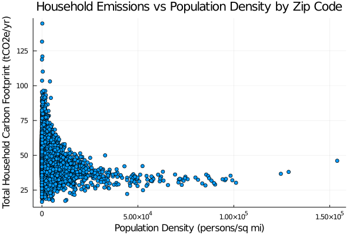

# Cool-Climate
A simple project exploring US emissions data using Julia.

## Loading in the Data
Thanks to the `CSV.jl` and `DataFrames.jl` packages, loading in the data is almost trivial. All we need is a quick one-liner:

```zip_df = DataFrame(CSV.File("Zip-Code-Results.csv"))```

Processing it is a little more complicated, however. An immediate inspection of our resultant DataFrame shows us that the types of our some of our numbers are strings, some missing values are represented as hyphens...

What we need is a quick function we can call to convert *any* numeric value in our table to the same data type:

```
process_num(x::AbstractString) = @pipe x |> strip |> replace(_, ","=>"") |> try parse(Float64, _) catch; missing end
process_num(x::Union{Integer,AbstractFloat}) = Float64(x)
```

Okay, well, it's technically two functions. But depending on your views on function uniqueness, it could just be one overloaded function.

Anyhoo, on to what it does. First of note, is it takes advantage of Julia's key feature, [multiple dispatch](https://en.wikipedia.org/wiki/Multiple_dispatch). At run-time, Julia will pick whichever function of the `process_num` name that matches the argument. In this case, if you call it on a string, it calls the first definition. On an integer or a float, it calls the second definition.

Because we have some numbers in a messy string format, we need to strip the whitespace and remove the commas. Finally, because we sometimes have plain hyphens and sometimes hyphens as negative signs, we need to know whether it's an actual negative number or just this dataset's placeholder for a missing value. The simplest way to do that is with error handling: `try` to parse it as a float, and if that fails, `catch` it and return `missing` (like a semantic version of `null` in Julia).

The second definition, on the other hand, is much easier, as it just casts the integer or float as a float.

To avoid any surprises later, I also added some unit tests to these functions; you can check them out in the source.

## Exploring the First Data
Now that we have the data squared away for now, let's check out some data. First that comes to mind is to see the relationship between household emissions and population density.



Well, now there's definitely an interesting relationship.

Before we get to printing up 13 more plots like this, let's find if there are any particularly interesting-looking ones, mathematically. To do that, let's calculate the correlation coefficients for our desired features and household emissions.

For our desired features, I just hard-coded which columns of the dataset have numerical values that don't directly giveaway the emissions values (that would be no fun).

```
correlations = map(col -> (col,cor(process_num.(zip_df[:,col]), zip_df[:,soln_col])), feature_cols)
```
Here, we're simply mapping each feature to its correlation with household emissions. Note that closer to +1 means strong positive correlation, and closer to -1 means strong negative correlation. Close to zero means little correlation at all.
|Feature Names                     |Correlation Coefficients|
|----------------------------------|------------------------|
|Population                        |-0.08376609186856607    |
|Persons Per Household             |0.36243407276312195     |
|Average House Value (USD)         |0.19398086222981614     |
|Income Per Household (USD)        |0.6850346508081455      |
|Latitude                          |0.1099946621189037      |
|Longitude                         |0.12086886248833183     |
|Elevation (ft)                    |-0.023540991504877595   |
|Population Density (persons/sq mi)|-0.20889311216420103    |
|Electricity (kWh)                 |0.5768390349819297      |
|Natural Gas (cu ft)               |0.29946260466377744     |
|Vehicle Miles Traveled            |0.8124459117758686      |
|Households Per Zip Code           |-0.1398604899445061     |

One thing we quickly see is there's a relatively strong correlation between persons per household and household emissions. In other news, water is wet. Turns out that having more people in a household tends to cause more emissions. Let's find a better metric.

## Exploring Per-Capita Data
The dataset does not have a column for 